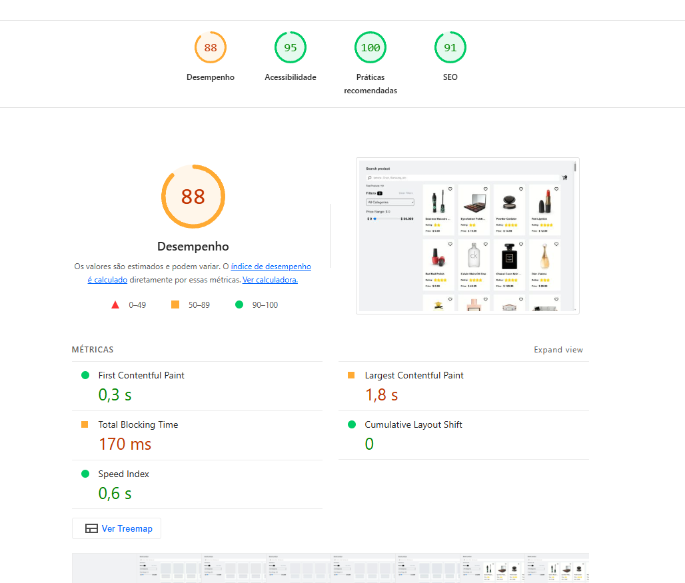

# 💻 Desafio Técnico – SIEG FRONT-END

​

## ⭐ Objetivo

​
Desenvolver uma página no estilo Catálogo de Produtos com funcionalidades como: favoritas, pesquisar por nome, filtras por preço e categoria, exibir informações sobre o item ao seleciona-lo e adicionar o item escolhido ao carrinho.
​

---

# ⭐Decisões técnicas:

1 - Implementação de filtros por nome, preço e categoria. Onde esses últimos **não são feitos através de novas requisições** e sim com base nos dados obtidos na primeira consulta ao endpoint.

2 - **Não** utilizei CSS adicional, apenas o tailwind.

3 - **Respeitar a responsividade para mobile, tablet e desktop**

5 - **Tecnologias e abordagens utilizadas:**

-   **Axios** - para realizar fetch do endpoint sugerido ( https://dummyjson.com/ )

-   **Zustand** - Fácil manuseio para gerenciar de forma global a aplicação, para que evite por exemplo, Prop drilling e o que torna o código mais flexivel.
-   **Tailwind** - o que facilita bastante durante a criação de interfaces amigáveis e que necessitam de um desenvolvimento mais "rápido". Com isso, utilizei a abordagem **mobile first** como ponto inicial para o meu desenvolvimento.
-   **CleanUp** - Para evitar que os componentes continuem executando alguma ação mesmo depois ele não exista mais.
-   **Componentização** - Fragmentação do código em diversos componentes, afim de deixa-lo mais legível, testável e modular.
-   **Custom Hooks** - Foram criados com a finalidade de: - **useDebounce** - Fazer com que os dados do input, por exemplo, não seja enviado a cada caractere digitado, mas só após 300ms, para que não gere gargalo durante o envio das requisições. - **useResponsive** - Tem como objetivo identificar a resolução atual da aplicação e aplicar alguma ação com base nisso. Utilizei de maneira simples e isolada, apenas para exemplificar a utilização, já que apenas com tailwind nós conseguiremos um resultado semelhante. - **useProducts** - obter as informações que serão requisitadas, seja na primeira requisição ou através do nome do item.
    6 - **Testes unitários** - foi utilizado o Jest para fazer pequenos testes unitários, afim de garantir a entrega da funcionalidades implementadas.

7 - Criação de um arquivo de **api** onde centralizei as chamadas para o endpoint.

## 📝 O que faria se tivesse mais tempo:

-   Trabalhar mais na interface e utilizar uma biblioteca como o shadcn, por exemplo.
-   Tentar deixar o código mais semântico e otimizado, se fosse necessário.
-   Entender o porque que não está funcionando a troca entre os modos(dark & light).

### 📝 Como rodar o projeto

Antes de tudo, você precisa clonar o repositório

```bash
  git clone https://github.com/henriquegoncalvessilva/sieg-test-frontend.git
```

Após isso, entre no diretório

```bash
  cd minha-pasta/sieg-test-frontend/>
```

Instale todas as dependências. Esse passo é muito importante para o sucesso das demais etapas.

```bash
  npm install
```

Rode o projeto com o código abaixo

```bash
  npm run dev
```

Rode os testes unitários com o código abaixo

```bash
  npm run test
```

### 📝 Decisões técnicas

### Rodando o projeto localmente

Antes de tudo, você precisa clonar o repositório

```bash
  git clone https://github.com/henriquegoncalvessilva/sieg-test-frontend.git
```

Instale todas as dependências. Esse passo é muito importante para o sucesso das demais etapas.

```bash
  npm install
```

Rode o projeto com o código abaixo

```bash
  npm run dev
```

Rode os testes unitários

```bash
  npm run test
```

### Deploy

Para o deploy, utilizei o Vercel devido a sua fácilidade de realizar tal ação. Segue abaixo o link do **deploy**

https://sieg-test-frontend.vercel.app/

### Screenshots

Estrutura das pastas e arquivos.


Obs: Preferi por dividir uma pasta para componentes e uma pasta para componentes em geral(ui). A estrutura basicamente de cada pasta consistem em:

-   componente
    -   style
    -   arquivoteste(se for o caso)

## Layouts

As telas foram testadas usando o plugin(navegador) Reponsive Viewer e o inspector do navegador.

### Mobile


### Tablet


### Notebook - Desktop


## Status de acessibilidade e desempenho - Lighthouse


